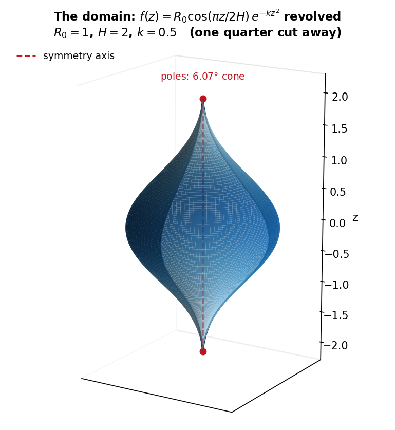
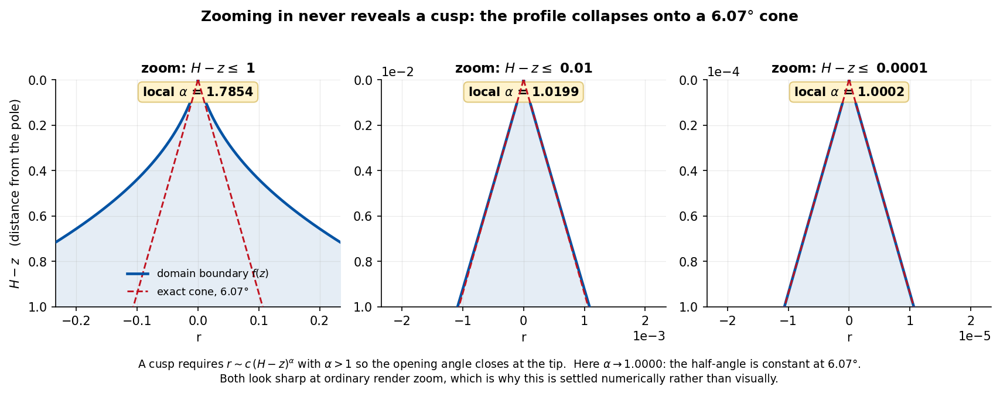
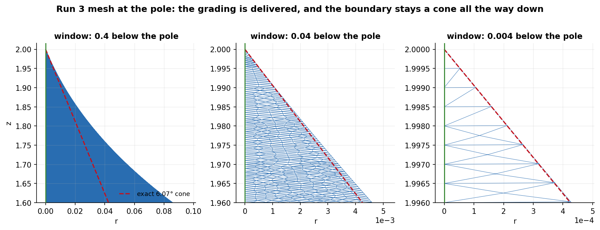
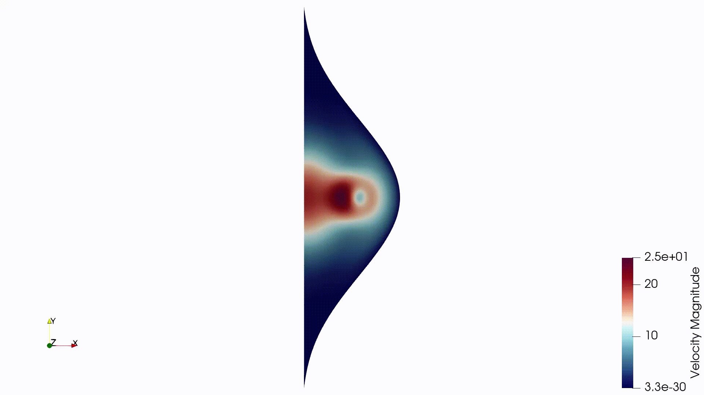
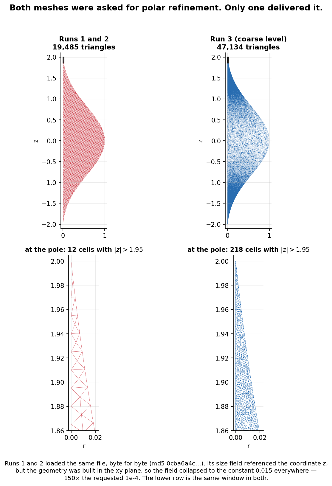
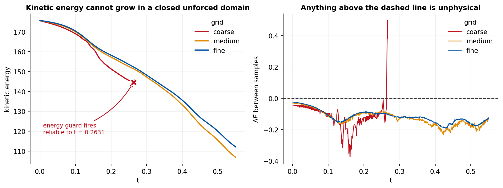
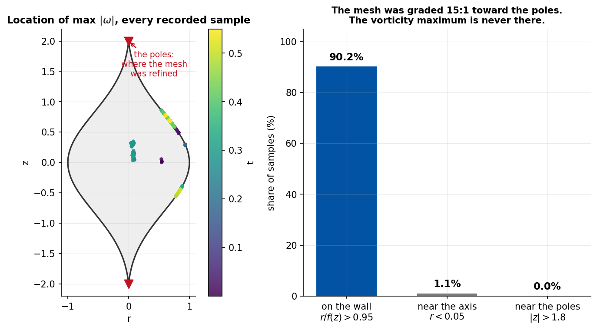
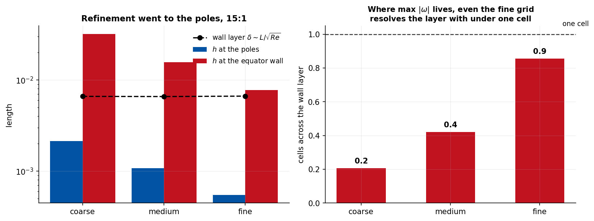
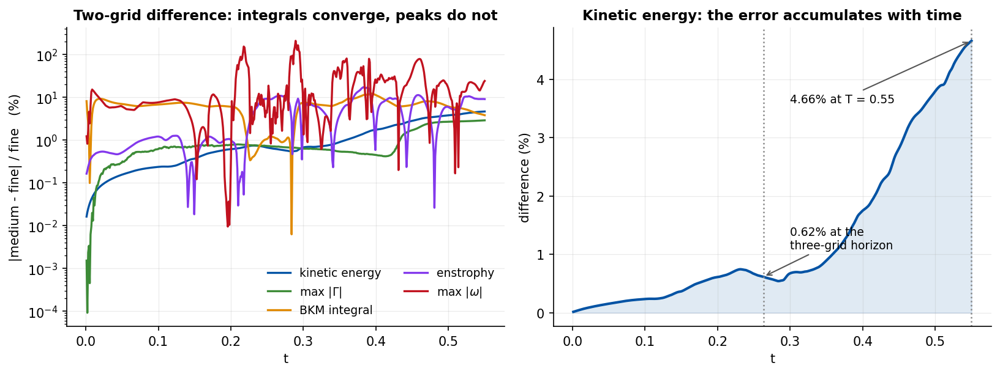

# Searching for a Navier–Stokes Singularity, and Verifying That I Didn't Find One

I ran the same simulation twice: once on a laptop, once on a 16-core AWS instance,
to measure what more resolution would do. Months later I found that both runs had
loaded **the same mesh file, byte for byte**.

```
0cba6a4c2eb0baa64c19dbde072f180b   run_01/…/apple_domain_R1.msh
0cba6a4c2eb0baa64c19dbde072f180b   run_02/…/apple_domain_R2.msh
```

The refinement I thought I was buying never existed. Neither did the finite-time
blow-up the second run appeared to find. This repository is the third attempt —
the one built to be checkable — together with a full account of how the first two
produced confident, wrong answers without a single error message.

**The result is a null one:** on two independent grids, kinetic energy decreases
strictly and the Beale–Kato–Majda integral stays bounded out to `T = 0.55`. No
evidence of singular growth. The interesting part is what it took to be able to
say that with a straight face.

---

## Contents

| | |
| :-- | :-- |
| [What this is, and is not](#what-this-is-and-is-not) | scope, and what a simulation can never settle |
| [Where the question comes from](#where-the-question-comes-from) | the Hou–Chen programme |
| [The domain is a cone, not a cusp](#the-domain-is-a-cone-not-a-cusp) | settled numerically, not visually |
| [Three iterations](#three-iterations) | what actually happened |
| [Five silent failures](#five-silent-failures) | none of them raised an error |
| [Five guards worth stealing](#five-guards-worth-stealing) | the transferable part |
| [The convergence study](#the-convergence-study) | including where it does not converge |
| [What the result means](#what-the-result-means) | in the Hou–Chen context |
| [Limitations](#limitations) | stated plainly |
| [How this was built](#how-this-was-built) | verification as the bottleneck |
| [Reproducing it](#reproducing-it) | |
| [References](#references) | |

---

## What this is, and is not

The motivation is the Clay Millennium Problem: whether smooth solutions of the 3D
incompressible Navier–Stokes equations can develop a finite-time singularity. The
idea was to build a geometry that squeezes a vortex ring hard enough to find out.

**No simulation can settle that question, and this one does not try.** The Clay
formulation concerns smooth domains, or the whole space, or the torus. An
engineered domain with a built-in geometric feature is already a different
problem. A floating-point computation is evidence at best, never a proof. Where a
result here looks suggestive, the correct reading is "the data observed are
consistent with", never "this shows".

What the repository *is*: a verification-driven case study. Each methodological
choice is motivated on general grounds, each claim is pinned by a test, and the
uncertainty on every number is reported — including the numbers that did not
converge.

## Where the question comes from

The starting point was the work of Thomas Hou, Jiajie Chen and collaborators, who
have spent a decade turning "can it blow up?" into something computable.

| | equations | domain | viscosity | outcome |
| :-- | :-- | :-- | :-- | :-- |
| Luo & Hou 2014 | Euler | cylinder **with a solid wall** | none | blow-up on a **boundary ring** |
| Hou 2022 | Euler | interior | none | potential singularity at the origin |
| Hou & Huang 2023 | Euler / NS | — | **degenerate**, vanishing as O(r²)+O(z²) | potential self-similar singularity |
| Hou 2023 | **Navier–Stokes** | — | **constant** | potentially singular behaviour, vorticity ×10⁷ |
| Chen & Hou 2025 | Euler | smooth data and boundary | none | **computer-assisted proof** |

Two things in that table shaped this project, and one of them corrected a mistake
I had made in reasoning about it.

**Constant viscosity does not by itself rule the phenomenon out.** Hou's 2023
paper reports potentially singular behaviour in Navier–Stokes with *uniform*
viscosity. So a null result here cannot be explained away as "viscosity always
wins".

**What does the work is the initial data and the resolution.** Hou & Huang state
that standard Navier–Stokes with uniform viscosity *prevents* blow-up **for
identical initial conditions** — the singular behaviour appears only when the
data are constructed to sit on a self-similar profile, computed with dynamic
rescaling at effective resolutions no fixed mesh can reach.

This run uses generic initial data, a fixed graded mesh, and `Re ≈ 2.3 × 10⁴`.
Nothing in that regime is expected to go singular. The null result is the
expected outcome — which is exactly why it is worth reporting *with* the
verification that says the solver would have been able to see one.

## The domain is a cone, not a cusp

The fluid is confined to the volume of revolution of
`f(z) = R₀ cos(πz/2H) · exp(−kz²)`, with `R₀ = 1`, `H = 2`, `k = 0.5`. A vortex
ring is injected into a background jet and advected toward the narrowing pole,
where conservation of angular momentum amplifies the swirl.



Rendered, it comes to a sharp point at each pole, and it is natural to call that a
cusp. It is not one. Near `z = H` the profile vanishes **linearly**, so the local
exponent in `r ~ c(H−z)^α` tends to 1 and the opening angle is *constant*:



A cusp needs `α > 1`, so the angle closes at the tip. Here `α → 1.0000` and the
half-angle sits at **6.07°** all the way down. A 6° cone and a true cusp are
visually indistinguishable at ordinary render zoom, which is why this has to be
settled numerically — the eye gives the wrong answer, and
`tests/test_mesh.py::test_domain_is_a_cone_not_a_cusp_at_the_poles` pins it so it
cannot be forgotten again.

### Why a cone is the right domain, and a cusp would not be

It would be easy to read the above as a shortfall — the geometry fell short of the
cusp it was meant to be. The opposite is closer to the truth: **a true cusp would
make the question unanswerable**, for three reasons that compound.

**A cusp domain is not Lipschitz.** With `α > 1` the boundary's tangent vanishes at
the tip: the two sides meet tangentially rather than at an angle. That is the
textbook example of a non-Lipschitz domain, and the standard well-posedness theory
for Navier–Stokes — which assumes a Lipschitz (or at least John) boundary — does
not apply there. A cone of fixed half-angle is Lipschitz, and the theory does.

**A singularity found in a cusp could not be attributed.** The domain would carry
its own geometric singularity, at exactly the point where the flow is most
compressed. Any loss of regularity observed there would be indistinguishable from
one produced by the boundary itself. The result would not be falsifiable, which is
a worse outcome than a null one.

**A cusp cannot be meshed under refinement control.** Resolving a closing angle
requires an element count and aspect ratios that diverge as the tip is approached.
There is no sequence of grids with a common refinement factor, so no observed
order, no Richardson extrapolation, and no GCI — the entire apparatus in
[`docs/convergence.md`](docs/convergence.md) would be undefined.

The cone keeps the mechanism the study is about — `r → 0` as `z → H`, so the
compression and the swirl amplification are both present — while remaining a
domain in which a negative answer means something. What it gives up is the
*accelerating* narrowing: the angle is constant rather than closing.

**Two honest qualifications.** First, this was not the original reasoning. The
profile was inherited from the earlier runs, believed at the time to be a cusp, and
kept unchanged so results stayed comparable; the argument above is a justification
found afterwards, not a design rationale. Second, the `1/r³` vortex-stretching
amplification that motivates this class of geometry is derived for the inviscid
axisymmetric reduction, and is not by itself evidence about this domain.

There is also an empirical answer, which arrives later in the study and is blunter
than any of the above: across all 551 recorded samples, the maximum of `|ω|` sits at
the poles in **0.0 %** of them. The vertex geometry did not drive the dynamics at
all — see [the refinement went to the wrong place](#the-refinement-went-to-the-wrong-place).
Note also that the Luo–Hou blow-up, the closest thing to a template for this kind
of search, occurs at the wall of a **cylinder**. No cusp is involved there either.

The production mesh at the pole, with the exact cone overlaid:



## Three iterations

<table>
<tr>
<td width="33%"></td>
<td width="33%"></td>
<td width="33%"></td>
</tr>
<tr>
<td><b>Run 1</b> — local, single core. Integrated to <code>T = 0.55</code>.
Final max |u| = 11.85, which is plausible; final max |ω| = 3.12 × 10⁶, which is
not, on a mesh whose largest representable vorticity is about 10³.</td>
<td><b>Run 2</b> — AWS, 16 ranks, adaptive <code>dt</code>, intended as the
high-resolution counterpart. Integrated to |u| = 9.4 × 10²¹ without stopping.
<b>Spectacular, and an artefact.</b> The mesh was Run 1's.</td>
<td><b>Run 3</b>, fine grid — 752,803 cells, 4.5 M velocity DOFs, 14 h on 8 ranks.
Reaches <code>T = 0.55</code> with kinetic energy decreasing at every one of 550
samples. <b>Undramatic, and the actual result.</b></td>
</tr>
</table>

The third panel is what a converged run of this problem looks like, and it is worth
sitting with how much less arresting it is than the second. Run 2's animation is the
more persuasive image, and it is the one that is wrong.

**Run 3** is this repository: rewritten solver, rewritten mesh generator, axis-safe
diagnostics, 50 regression tests, and a three-resolution convergence study with
error bars. Runs 1 and 2 are preserved unmodified under [`archive/`](archive/),
each with a note on what is wrong with it — they are the evidence for the section
below.

## Five silent failures

Not one of these raised an exception. Every one produced numbers that looked
reasonable enough to write down. Full analysis with derivations in
[`docs/findings.md`](docs/findings.md).

| # | failure | measured |
| --: | :-- | :-- |
| 1 | **The mesh size field silently degenerated.** A gmsh `MathEval` field referenced the coordinate `z`, but the geometry was built in the xy plane, so `z ≡ 0` at every node and the field collapsed to a constant. | requested `h = 1e-4`, delivered `0.015` — **150× off**, and identical for both runs |
| 2 | **The vorticity diagnostic amplified round-off.** `u_θ/(r + 1e-14)` evaluated at DG1 vertices, which sit exactly on the symmetry axis. | **1373×** error on the *exact analytic* initial condition, before any physics |
| 3 | **The published reliability threshold was noise.** An automated log-growth detector fired on the first sample exceeding a rate cutoff. | a **0.665 %** velocity change across one 25 µs sample, in a window where the vorticity was *decreasing* |
| 4 | **The momentum operator went stale.** Reassembled only when `dt` changed, though it carries the velocity as a coefficient. | frozen for **62.8 %** of the recorded run |
| 5 | **The projection had no boundary conditions.** No `apply_lifting`, no `set_bc`, so the corrected velocity satisfied neither no-slip nor the axis conditions. | this is what fed failure 2 |

The through-line: **every one of these is invisible to code review and visible to
verification.** Reading the mesh generator does not reveal that `z` is zero;
measuring the delivered element size does, immediately.



## Five guards worth stealing

The reusable part of this work. Each is motivated generally, not as a patch for a
past mistake. Details in [`docs/methodology.md`](docs/methodology.md).

**1. The energy guard.** In a closed domain with no-slip walls and no body force,
`dE/dt = −2ν ∫|D(u)|² ≤ 0` holds exactly. So **any growth in kinetic energy is
numerical by definition** — no arbitrary constant, no tuning. Unlike a velocity
threshold it needs no scale; unlike a CFL check it actually fires, because loss of
spatial resolution does not violate CFL. It stops the run at the first sample 1 %
above the running minimum and reports the energy minimum as the reliable horizon.

**2. Axis-safe diagnostics.** Cylindrical vorticity has a removable singularity at
`r = 0`. Rather than regularising it with an epsilon, evaluate at **interior
quadrature points**: a Gauss point of a triangle has all barycentric coordinates
strictly positive, so it can only lie on the axis if all three vertices do. No
epsilon is needed and none is used. `Diagnostics.audit()` asserts the property on
the actual mesh and refuses to run if it fails. Against the exact initial
condition this returns **352.59 versus an analytic 351.64** — 0.27 %.

**3. Mesh verification.** The generator measures what gmsh actually produced and
raises if the achieved polar size misses the request. Run against the old recipe
it fires immediately. Symbolic size fields can degenerate in ways that are
invisible in the source; **always check delivered against requested.**

**4. Checked linear solves.** PETSc does not raise when a preconditioner breaks
down — it sets a negative converged reason and leaves `Inf` in the solution. This
happened for real here: the r-weighted mass matrix has diagonal entries down to
**6.7 × 10⁻¹⁵** in cells touching the axis, ILU-in-block-Jacobi fails there, and
the projection returned reason **−11 (`DIVERGED_PC_FAILED`)** with an `Inf`
velocity field. `check_ksp` aborts on any negative reason.

**5. Cell-local CFL.** `min(h)/max|u|` over the whole mesh pairs the smallest cell
with the fastest fluid even when they sit at opposite ends of the domain. Taking
`min over cells of h_cell/|u|_cell` is the correct local condition and, on these
graded meshes, gives a **6.1× larger step at the same true CFL** — measured: 15
steps instead of 92, 10.0 s instead of 52.7 s.

## The convergence study

Three grids, all lengths scaled by the same factor, `ν = 1e-3`, `T = 0.55`,
IPCS, 8 MPI ranks on an AWS `c6i.4xlarge`. Measured refinement ratios **1.985**
and **1.969** against a nominal 2, so the extrapolation is well conditioned. Full
detail in [`docs/convergence.md`](docs/convergence.md).

| level | cells | velocity DOFs | h at poles | outcome | trustworthy to | wall time |
| :-- | --: | --: | --: | :-- | --: | --: |
| coarse | 47,134 | 287,205 | 2.137e-3 | `energy_growth` | **0.2631** | 5.1 min |
| medium | 188,462 | 1,139,571 | 1.077e-3 | **`completed`** | 0.5500 | 1.6 h |
| fine | 752,803 | 4,534,410 | 5.467e-4 | **`completed`** | 0.5500 | 14.0 h |

<table>
<tr>
<td width="50%"></td>
<td width="50%"></td>
</tr>
<tr>
<td><b>coarse</b>, h at the poles 2.137e-3 — the energy guard stops it at
<code>t = 0.268</code>, having recorded the last physical state at
<code>t = 0.2631</code>.</td>
<td><b>fine</b>, h at the poles 5.467e-4 — runs the full interval with energy
decreasing throughout. The guard never fires.</td>
</tr>
</table>

The difference between those two is a factor of four in element size, and it is not
a gradual degradation: the medium grid, halfway between them, behaves like the fine
one — a resolution threshold rather than a gradual loss, discussed under
[what the result means](#what-the-result-means) below.



Two of the three grids reached `T` with **strictly decreasing kinetic energy** —
zero rising samples out of 550, on each — and never tripped the guard. Only the
coarse grid broke down. The right panel is the guard's actual signal: the coarse
level crosses zero at `t ≈ 0.263`, medium and fine never do.

Because the three-grid window is set by the coarsest level, formal error bars
exist only for `t ≤ 0.2631`:

| quantity | fine value | observed `p` | GCI | monotone | verdict |
| :-- | --: | --: | --: | --: | :-- |
| kinetic energy | 152.34 | 1.39 | **0.16 %** | **100 %** | converged |
| max \|Γ\| = r·u_θ | 5.4036 | 1.00 | 0.86 % | 92 % | converged |
| enstrophy | 91,232 | 1.82 | 0.40 % | **52 %** | **not in asymptotic range** |
| max \|ω\| | 2,156.5 | 1.15 | 6.93 % | 75 % | **not in asymptotic range** |
| BKM integral | 636.18 | 0.98 | 8.85 % | 92 % | order low, treat with care |

A monotone fraction of 52 % is a coin flip. For enstrophy and peak vorticity these
grids are **not** in the asymptotic range, and the extrapolated values are
artefacts rather than better answers. That is reported here rather than quietly
omitted, because it points at something real.

### The refinement went to the wrong place

The mesh is graded **15:1 toward the poles** — that is where the geometric feature
of interest is. It is not where the flow is.



Across all 551 recorded samples, the maximum of `|ω|` sits **on the wall in 90.2 %
of them**, at a median height of `z = 0.617`, and **never once** near the poles.
The extreme vorticity is a wall boundary-layer feature at mid-latitude, and the
grid is at its coarsest exactly there:



With `Re ≈ 2.3 × 10⁴` the wall layer is `δ ~ L/√Re ≈ 0.0066`. Against `h` at the
equator that is **0.2, 0.4 and 0.9 cells** for the three levels. Under one cell,
even on the finest grid. P2 elements soften this, but by any standard criterion
the layer is unresolved — which is precisely why `max|ω|` and enstrophy do not
converge while kinetic energy and circulation, dominated by the bulk, do.

**This is the most transferable finding in the study.** The grid was refined
according to geometric intuition rather than according to the flow; 12,162 cells
went to the poles where nothing happens; and the GCI table said so — `monotone =
52 %` — for anyone reading it.

### Two grids, and where their agreement ends



Medium and fine agree on the integral quantities and diverge on the pointwise
peaks. Kinetic energy differs by 0.62 % at the three-grid horizon and drifts to
4.66 % by `T = 0.55`; `max|ω|` differs by up to 200 %. Any claim built on peak
vorticity at late times would be unsupported. The null result is not: it rests on
energy and on the BKM integral, which agree to **3.8 %** (1850.3 versus 1782.3).

One more number worth stating: the strong divergence residual falls **0.42 → 0.12
→ 0.032** across the three levels — close to second order — but 3 % on the fine
grid is not nothing. The weak residual, which is what IPCS actually enforces, is
`1.6 × 10⁻⁶`.

## What the result means

Kinetic energy decays monotonically on two independent grids. The BKM integral
stays bounded. A singularity at `T*` requires `∫‖ω‖_∞ dt` to diverge, so a run in
which it stays finite has not blown up — regardless of how dramatic the vorticity
curve looks. **No evidence of singular growth was observed in the window and at
the resolutions tested.**

Set against the Hou–Chen programme, that is the expected outcome, and the honest
way to phrase it is:

> A verified solver, exercised on generic initial data at `Re ≈ 2.3 × 10⁴` on a
> fixed graded mesh, shows no singularity-consistent behaviour. This is the regime
> where none is expected: the reported near-singular behaviour in that literature
> requires initial data tuned to a self-similar profile and dynamic rescaling at
> effective resolutions orders of magnitude beyond a fixed mesh. What this run
> demonstrates is that the machinery *would have been able to detect* a loss of
> physicality — it did, on the coarse grid, at `t = 0.2631`.

The gap between this and Luo–Hou is not one of mesh grading or profile exponent.
It is structural. Closing it is not a matter of another iteration.

There is a genuine secondary finding: the breakdown is a **resolution threshold**,
not a smooth power law. A scaling `t_breakdown ~ h^−0.35` fitted on two validation
grids predicted the coarse level's breakdown to within 8 % and was **completely
wrong** about the medium level, which never broke down at all. The threshold sits
between `h_pole = 2.1e-3` and `1.1e-3`. Three points is thin evidence for a
threshold, and that caveat stands.

## Limitations

- **The domain is a 6.07° cone, not a cusp.** The `1/r³` stretching argument does
  not apply to it as written.
- **The wall boundary layer is unresolved** — under one cell even on the fine
  grid — and that is where the extreme vorticity lives. `max|ω|` and enstrophy are
  not converged.
- **Axisymmetry** excludes symmetry-breaking instabilities by construction.
- **One parameter point.** One viscosity, one initial condition, one geometry.
- **Two grids reached `T`; three did not.** Formal error bars exist only for
  `t ≤ 0.2631`.
- **A simulation is not a proof**, and this one has neither the intent nor the
  capacity to bear on the Clay problem.

Future work, in descending order of value: refine the wall rather than the poles;
verify the code's order of accuracy with the Method of Manufactured Solutions; a
true cusp profile with `α > 1`; a parameter sweep.

## How this was built

Writing the code was the cheap part. That is why this repository is organised
around verification rather than around the solver. Full account in
[`docs/how-this-was-built.md`](docs/how-this-was-built.md).

I chose the problem and the geometry, specified the physics and the parameter
point, sized the infrastructure, ran the three campaigns, and read the
output. AI assistance did a large share of the implementation — and produced, in
the first two attempts, all five silent failures above. It also did much of the
forensic work later, under direction, and wrote the 50 regression tests.

None of those five failures raised an error, and none would have been caught by
reading the code. What caught them was comparison against something independently
known: the analytic initial condition, the exact domain volume, the delivered
element size, a conservation law that must hold. **That apparatus is the actual
contribution here**, and choosing which invariants were worth checking is the part
no amount of generation supplies.

> Writing the code became nearly free. The bottleneck moved entirely to
> verification. Anyone who does not adjust for that produces wrong results faster
> than before.

**It ran as an argument, in both directions.** Nothing here arrived by asking a
question and keeping the answer: every substantive decision was reached by pushing
against a first answer until it held or broke, and several did not hold. An
assistant produces a confident, well-formed answer to almost any question,
including the ones where it is wrong, and the wrong ones look exactly like the
right ones — without someone willing to reject a framing rather than edit its
wording, the confident version is what reaches the document. What does not come
from the tool is judgement about the physics: deciding a number is wrong before any
analysis says so, choosing which invariants are worth checking, and deciding when
the work is finished.

*Note on a related but different use of AI in this field:* Wang, Lai,
Gómez-Serrano and Buckmaster (2023) used physics-informed neural networks as the
*numerical method* to discover self-similar blow-up profiles. That is a different
thing from what happened here, where an assistant wrote conventional FEniCSx code.
Conflating the two would be a category error.

## Reproducing it

```bash
conda env create -f environment.yml && conda activate fenicsx-env
```

```bash
python -m pytest tests -q
```

50 tests, about 40 seconds. They encode the findings directly:
`test_polar_refinement_is_actually_delivered` fails by 150× against the old
recipe; `test_vorticity_matches_the_analytic_initial_condition` checks 352.59
against 351.64; `test_the_r2_formula_reproduces_the_bug` confirms the diagnosis is
not a guess; `test_energy_guard_stops_an_unphysical_run` covers what CFL cannot
see.

```bash
python scripts/run_convergence.py --config configs/local_validation.json
```

```bash
python scripts/analyze_convergence.py --study results/convergence_aws
```

```bash
python scripts/make_figures.py
```

The last two need only numpy and matplotlib. Production deployment, with the
benchmark-before-you-commit step and cost control, is in [`deploy/`](deploy/).

Meshes are **regenerated, not shipped** — `src/mesh.py` is deterministic and
verifies its own output, so the recipe is the reproducible artefact. The HDF5
velocity fields are excluded from git for size; the recorded diagnostics that
every result in this README rests on are in [`results/`](results/).

## References

**The Hou–Chen programme**

1. G. Luo, T. Y. Hou, *Potentially singular solutions of the 3D axisymmetric Euler equations*, PNAS **111**(36), 12968–12973 (2014). [doi:10.1073/pnas.1405238111](https://doi.org/10.1073/pnas.1405238111) · [arXiv:1310.0497](https://arxiv.org/abs/1310.0497)
2. G. Luo, T. Y. Hou, *Toward the finite-time blowup of the 3D axisymmetric Euler equations: a numerical investigation*, Multiscale Model. Simul. **12**(4), 1722–1776 (2014).
3. T. Y. Hou, *Potentially Singular Behavior of the 3D Navier–Stokes Equations*, Found. Comput. Math. **23**, 2251–2299 (2023). [doi:10.1007/s10208-022-09578-4](https://doi.org/10.1007/s10208-022-09578-4) · [arXiv:2107.06509](https://arxiv.org/abs/2107.06509)
4. T. Y. Hou, *Potential singularity of the 3D Euler equations in the interior domain*, Found. Comput. Math. (2022). [arXiv:2107.05870](https://arxiv.org/abs/2107.05870)
5. T. Y. Hou, D. Huang, *Potential Singularity Formation of Incompressible Axisymmetric Euler Equations with Degenerate Viscosity Coefficients*, Multiscale Model. Simul. **21**(1), 218–268 (2023). [doi:10.1137/22M1470906](https://doi.org/10.1137/22M1470906) · [arXiv:2102.06663](https://arxiv.org/abs/2102.06663)
6. J. Chen, T. Y. Hou, *Finite Time Blowup of 2D Boussinesq and 3D Euler Equations with C^{1,α} Velocity and Boundary*, Comm. Math. Phys. **383**(3), 1559–1667 (2021). [arXiv:1910.00173](https://arxiv.org/abs/1910.00173) — see also the published [correction](https://doi.org/10.1007/s00220-022-04548-x)
7. J. Chen, T. Y. Hou, *Stable nearly self-similar blowup of the 2D Boussinesq and 3D Euler equations with smooth data*, I: Analysis [arXiv:2210.07191](https://arxiv.org/abs/2210.07191); II: Rigorous Numerics, Multiscale Model. Simul. **23**(1), 25–130 (2025). [arXiv:2305.05660](https://arxiv.org/abs/2305.05660)
8. J. Chen, T. Y. Hou, *Singularity formation in 3D Euler equations with smooth initial data and boundary*, PNAS **122**(27), e2500940122 (2025). [doi:10.1073/pnas.2500940122](https://doi.org/10.1073/pnas.2500940122)

**Theory and criteria**

9. J. T. Beale, T. Kato, A. Majda, *Remarks on the breakdown of smooth solutions for the 3-D Euler equations*, Comm. Math. Phys. **94**(1), 61–66 (1984).
10. T. M. Elgindi, *Finite-time singularity formation for C^{1,α} solutions to the incompressible Euler equations on ℝ³*, Annals of Math. **194**(3), 647–727 (2021). [doi:10.4007/annals.2021.194.3.2](https://doi.org/10.4007/annals.2021.194.3.2)
11. C. L. Fefferman, *Existence and smoothness of the Navier–Stokes equation*, Clay Mathematics Institute Millennium Problem description.

**Background reading**

12. D. Barkley, *A fluid mechanic's analysis of the teacup singularity*, Proc. R. Soc. A **476**(2240), 20200348 (2020). [doi:10.1098/rspa.2020.0348](https://doi.org/10.1098/rspa.2020.0348) — the most accessible account of Luo–Hou.
13. Y. Wang, C.-Y. Lai, J. Gómez-Serrano, T. Buckmaster, *Asymptotic Self-Similar Blow-Up Profile for Three-Dimensional Axisymmetric Euler Equations Using Neural Networks*, Phys. Rev. Lett. **130**, 244002 (2023). [doi:10.1103/PhysRevLett.130.244002](https://doi.org/10.1103/PhysRevLett.130.244002)

**Verification and validation**

14. P. J. Roache, *Verification and Validation in Computational Science and Engineering*, Hermosa (1998).
15. ASME V&V 20-2009, *Standard for Verification and Validation in Computational Fluid Dynamics and Heat Transfer* — the non-uniform-ratio GCI procedure used here.
16. W. L. Oberkampf, C. J. Roy, *Verification and Validation in Scientific Computing*, Cambridge (2010).

---

## Layout

```text
├── src/         solver, mesh generator, initial conditions, axis-safe diagnostics
├── scripts/     convergence driver, GCI analysis, plots, figure generation
├── configs/     local validation and AWS production study definitions
├── tests/       50 regression tests, one per finding
├── deploy/      AWS setup, launch and cost control
├── results/     recorded diagnostics and provenance for every level
├── docs/        findings, methodology, convergence, AI workflow
├── media/       figures and animations used above
└── archive/     Runs 1 and 2, unmodified, as evidence
```

Licensed under the terms in [LICENSE](LICENSE).
